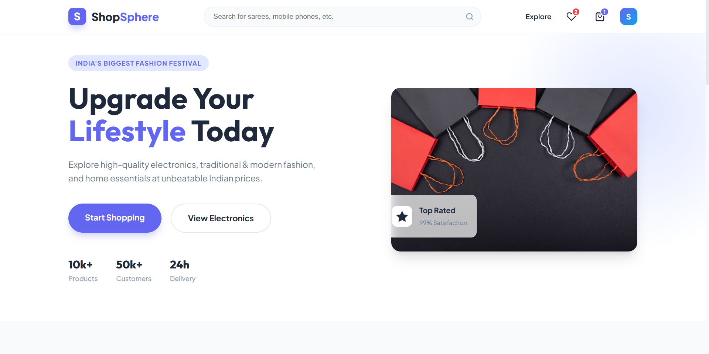
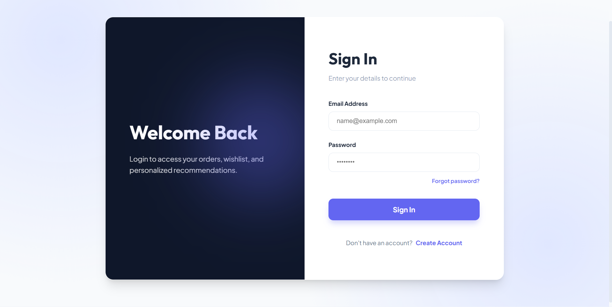
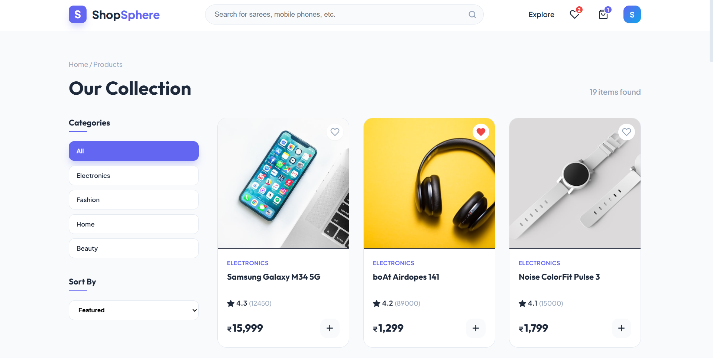
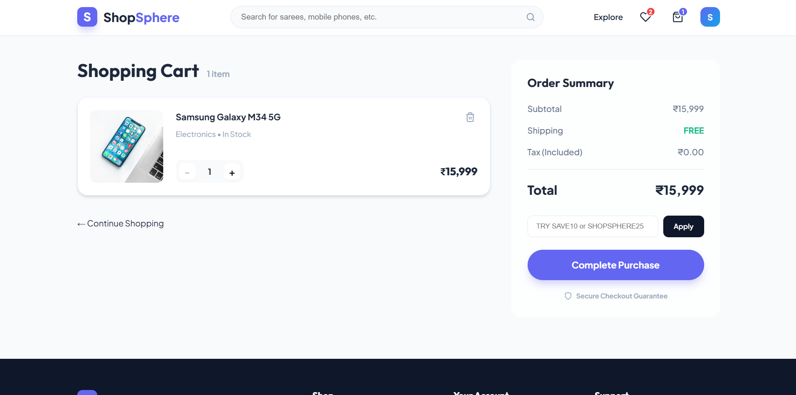

# ShopSphere — Modern E-Commerce Platform


**ShopSphere** is a modern, responsive **e-commerce frontend application** built with **React 19** and **Vite**.  
It provides a smooth shopping experience with product browsing, cart flow, and a dedicated login interface.

**Live Demo:** https://shopsphere-modern-e-commerce-platfo.vercel.app  

---

## Overview

ShopSphere is designed as a scalable SPA (Single Page Application) that demonstrates modern frontend development practices, clean routing architecture, and an extensible foundation for full-stack e-commerce enhancements.

It is ideal for showcasing:

- React component-based UI development  
- Client-side routing  
- Responsive layout design  
- E-commerce application structure  

---

## Key Features  

- **Modern Shopping UI:** Clean and professional e-commerce design.  
- **Product Browsing:** Explore products through structured pages and navigation.  
- **Login Page:** Dedicated user login interface for authentication flow (frontend).  
- **Cart Functionality:** Add and manage products in the shopping cart.  
- **Smooth Navigation:** Implemented using **React Router DOM v7**.  
- **Fast Performance:** Powered by **Vite** for instant builds and reloads.   

---

## Screenshots

> Screenshots of the UI are available below for quick preview.

| Page | Preview |
|------|---------|
| Homepage |  |
| Login Page |  |
| Products |  |
| Cart |  |

---

## Tech Stack

| Category | Technology |
|----------|------------|
| Frontend Framework | React.js 19 |
| Routing | React Router DOM v7 |
| Build Tooling | Vite |
| Language | JavaScript (ES Modules) |
| Styling | CSS3 |

---

## Getting Started

Follow these steps to run ShopSphere locally.

### 1️ Clone the Repository

```bash
git clone https://github.com/Shyamkumarnagilla/shopsphere-modern-e-commerce-platform.git
cd shopsphere-modern-e-commerce-platform
```

### 2️ Install Dependencies

```bash
npm install
```

### 3️ Run Development Server

```bash
npm run dev
```

Application will be live at:

```arduino
http://localhost:5173
```

---

## Available Scripts

- `npm run dev` — Start development server  
- `npm run build` — Build for production  
- `npm run preview` — Preview production build  
- `npm run lint` — Run ESLint checks  

---

## Project Structure

```bash
shopsphere/
├── public/
├── src/
│   ├── components/        # Reusable UI components
│   ├── pages/             # Pages (Home, Login, Products, Cart)
│   ├── assets/            # Images, icons, static resources
│   ├── App.jsx            # Main app component
│   ├── main.jsx           # React entry point
│   └── index.css          # Global styles
├── package.json
├── vite.config.js
└── README.md
```

---

## Deployment

ShopSphere can be deployed easily on modern hosting platforms:

- **Vercel** *(Recommended)*
- **Netlify**
- **Render** *(Static Hosting)*

### Deploy on Vercel

1. Push code to GitHub
2. Go to **vercel.com**
3. Import your repository
4. Click **Deploy** 

---

## Author

Developed by   **Shyam Kumar Nagilla** 

- GitHub: https://github.com/Shyamkumarnagilla
- LinkedIn: https://www.linkedin.com/in/nagilla-shyam
- Email: nagillashyamkumar7@gmail.com

---

*If you find this project valuable, consider giving it a star to support the work!*